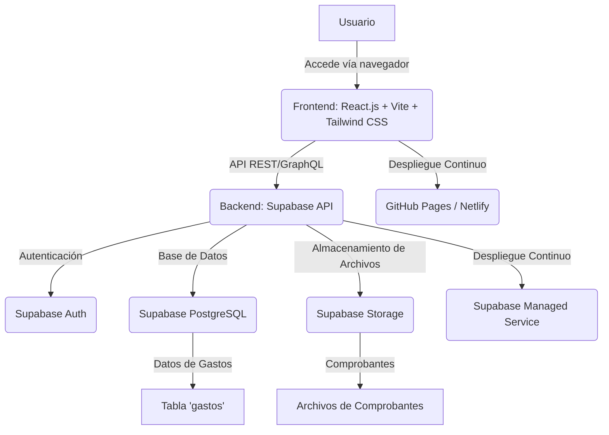

# Especificación Técnica Detallada - Aplicación Web Control de Caja Chica ESM Argentina

## 1. Introducción

Este documento detalla la especificación técnica para el desarrollo de una aplicación web destinada al control de gastos de caja chica de ESM Argentina. El objetivo principal es proporcionar una herramienta robusta, intuitiva y segura que permita a los socios registrar sus gastos de manera eficiente y a Juan Pablo Rúa, como administrador principal, gestionar, validar y exportar la información de manera centralizada. Se priorizará la implementación de las mejores prácticas en desarrollo de software, diseño de interfaz de usuario (UI/UX) y arquitectura de sistemas para asegurar una solución escalable y de alto rendimiento.

## 2. Alcance del Proyecto

El alcance de este proyecto abarca el diseño y la implementación de una aplicación web con las siguientes funcionalidades clave:

- **Registro de Gastos:** Un formulario intuitivo para que los socios y la contadora registren sus gastos, incluyendo detalles como fecha, monto, medio de pago, categoría, descripción y la posibilidad de adjuntar comprobantes.
- **Gestión de Comprobantes:** Flexibilidad para adjuntar comprobantes mediante carga de archivos (imágenes, PDF, capturas de pantalla) o directamente desde la cámara del dispositivo.
- **Panel de Control Administrativo:** Una interfaz dedicada para Juan Pablo Rúa que permita visualizar, filtrar, aprobar, rechazar y editar gastos, así como generar reportes detallados.
- **Reportes y Exportación:** Funcionalidades para exportar datos de gastos en formatos CSV o PDF, con todos los atributos relevantes para el análisis financiero.
- **Gestión de Usuarios y Roles:** Un sistema de autenticación y autorización que defina los permisos específicos para cada tipo de usuario (socios, contadora, administrador).
- **Preparación para Integración por Correo:** La arquitectura contemplará la futura integración de un sistema de registro de gastos vía correo electrónico.

Este documento servirá como la guía principal para el equipo de desarrollo, asegurando que todas las funcionalidades y requisitos técnicos sean comprendidos y abordados de manera consistente.

## 3. Arquitectura del Sistema

La aplicación se construirá siguiendo una arquitectura moderna y desacoplada, utilizando un enfoque de aplicación de una sola página (SPA) para el frontend y un backend basado en servicios en la nube. Esta elección tecnológica garantiza escalabilidad, mantenibilidad y una experiencia de usuario fluida. La arquitectura propuesta se basa en las mejores prácticas actuales y en la experiencia exitosa de proyectos anteriores de ESM Argentina.

### 3.1. Visión General de la Arquitectura

La arquitectura se compone de tres capas principales:

1.  **Frontend (Capa de Presentación):** Responsable de la interfaz de usuario y la interacción con el usuario. Se ejecutará en el navegador del cliente.
2.  **Backend (Capa de Lógica de Negocio y API):** Manejará la lógica de negocio, la autenticación, la autorización y la comunicación con la base de datos y el almacenamiento de archivos.
3.  **Base de Datos y Almacenamiento (Capa de Datos):** Almacenará la información estructurada de los gastos y los archivos de los comprobantes.

### 3.2. Componentes Tecnológicos

Se han seleccionado las siguientes tecnologías por su robustez, flexibilidad y facilidad de despliegue:

| Componente | Tecnología | Descripción | Razones de Elección |
|---|---|---|---|
| **Frontend** | React.js (con Vite) | Biblioteca JavaScript para construir interfaces de usuario interactivas y eficientes. Vite como bundler para un desarrollo rápido. | Amplia comunidad, alto rendimiento, modularidad, facilidad de desarrollo de SPA. Vite ofrece una experiencia de desarrollo superior. |
| **Estilos CSS** | Tailwind CSS | Framework CSS utilitario que permite construir diseños personalizados rápidamente sin salir del HTML. | Desarrollo ágil, alta personalización, tamaño de archivo optimizado, consistencia en el diseño. |
| **Backend & DB** | Supabase | Plataforma de código abierto que proporciona una base de datos PostgreSQL, APIs REST y GraphQL, autenticación y almacenamiento de archivos. | Solución 

open source, escalable, incluye autenticación y almacenamiento, ideal para MVP y crecimiento. |
| **Autenticación** | Supabase Auth | Sistema de autenticación integrado de Supabase que soporta múltiples métodos de login y gestión de usuarios. | Integración nativa con Supabase, seguridad robusta, facilidad de implementación de roles y permisos. |
| **Almacenamiento** | Supabase Storage | Servicio de almacenamiento de objetos para guardar archivos (imágenes, PDFs) de forma segura y escalable. | Integración nativa con Supabase, gestión de permisos, optimizado para archivos de usuario. |
| **Despliegue (Frontend)** | GitHub Pages / Netlify | Plataformas de hosting estático que permiten desplegar aplicaciones web directamente desde un repositorio de Git. | Despliegue rápido y automatizado, bajo costo, alta disponibilidad, integración con CI/CD. |
| **Despliegue (Backend)** | Supabase (Managed Service) | Supabase ofrece su propio servicio gestionado para el backend, eliminando la necesidad de configurar servidores. | Facilidad de gestión, escalabilidad automática, seguridad y backups gestionados. |
| **Control de Versiones** | Git / GitHub | Sistema de control de versiones distribuido y plataforma de alojamiento de repositorios. | Colaboración en equipo, seguimiento de cambios, gestión de ramas, integración con despliegue automatizado. |

### 3.3. Diagrama de Arquitectura (Conceptual)

## 4. Base de Datos

La base de datos principal para la aplicación será PostgreSQL, gestionada a través de Supabase. Se diseñará una tabla `gastos` para almacenar toda la información relevante de cada transacción de caja chica. La estructura de la tabla se ha definido para ser eficiente y escalable, permitiendo futuras expansiones si fuera necesario.

### 4.1. Esquema de la Tabla `gastos`

| Campo | Tipo de Dato | Descripción | Restricciones / Notas |
|---|---|---|---|
| `id` | `UUID` | Identificador único universal para cada gasto. | Clave primaria, autogenerado. |
| `fecha` | `DATE` | Fecha en que se realizó el gasto. | Obligatorio. No puede ser una fecha futura. |
| `usuario_id` | `UUID` | Referencia al ID del usuario que cargó el gasto. | Clave foránea a la tabla de usuarios de Supabase Auth. Obligatorio. |
| `monto` | `NUMERIC(10, 2)` | Valor monetario del gasto. | Obligatorio. Debe ser mayor que 0. Precisión de 2 decimales. |
| `medio_pago` | `VARCHAR(50)` | Método utilizado para el pago (ej. 'efectivo', 'transferencia', 'billetera', 'tarjeta'). | Obligatorio. Se recomienda un `ENUM` o tabla de referencia para valores predefinidos. |
| `categoria` | `VARCHAR(100)` | Categoría a la que pertenece el gasto (ej. 'viáticos', 'útiles', 'transporte', 'alimentación'). | Obligatorio. Se recomienda un `ENUM` o tabla de referencia editable por el administrador. |
| `descripcion` | `TEXT` | Descripción detallada o concepto del gasto. | Opcional. |
| `archivo_url` | `TEXT` | URL del comprobante adjunto almacenado en Supabase Storage. | Opcional. Puede ser `NULL` si no se adjunta comprobante. |
| `estado` | `VARCHAR(20)` | Estado actual del gasto (ej. 'pendiente', 'aprobado', 'rechazado'). | Obligatorio. Valor por defecto: 'pendiente'. |
| `comentario_admin` | `TEXT` | Comentarios internos de Juan Pablo Rúa sobre el gasto. | Opcional. Solo visible y editable por el administrador. |
| `created_at` | `TIMESTAMP WITH TIME ZONE` | Fecha y hora de creación del registro del gasto. | Autogenerado, no editable. |
| `updated_at` | `TIMESTAMP WITH TIME ZONE` | Última fecha y hora de actualización del registro del gasto. | Autogenerado, se actualiza en cada modificación. |

### 4.2. Índices y Optimización

Se crearán índices en los campos `fecha`, `usuario_id`, `estado` y `categoria` para optimizar las consultas y los filtros en el panel de control y los reportes. La elección de `NUMERIC(10, 2)` para el monto asegura precisión en los cálculos financieros. El uso de `UUID` como clave primaria distribuye mejor los datos y evita problemas de concurrencia en entornos distribuidos.

## 5. Autenticación y Autorización

La seguridad y el control de acceso son fundamentales para esta aplicación. Se utilizará Supabase Auth para gestionar la autenticación de usuarios y la asignación de roles, garantizando que cada usuario tenga acceso únicamente a las funcionalidades y datos que le corresponden.

### 5.1. Roles de Usuario

Se definirán los siguientes roles de usuario:

-   **`admin_principal` (Juan Pablo Rúa):** Acceso total a todas las funcionalidades. Puede ver, editar, aprobar, rechazar y exportar todos los gastos. Es el único que puede realizar acciones administrativas sobre los gastos.
-   **`socio_operador` (Luis Tello, Eugenio Cavallaro):** Puede cargar nuevos gastos y visualizar únicamente los gastos que él mismo ha registrado. No tiene permisos para aprobar, rechazar o editar gastos de otros usuarios.
-   **`contadora` (Noelia):** Puede cargar nuevos gastos y consultar todos los gastos, así como generar reportes. No tiene permisos para aprobar, rechazar o editar gastos.

### 5.2. Flujo de Autenticación

1.  **Registro/Login:** Los usuarios se autenticarán utilizando un sistema de login simple (ej. correo electrónico y contraseña, o token si se prefiere una autenticación más ligera). Supabase Auth manejará el proceso de registro, verificación de correo y gestión de sesiones.
2.  **Asignación de Roles:** Una vez autenticado, el rol del usuario se determinará y se almacenará en la base de datos de Supabase (posiblemente en la tabla `auth.users` o en una tabla de perfiles personalizada). Los permisos se aplicarán a nivel de Row Level Security (RLS) en PostgreSQL y a nivel de API en el backend.
3.  **Protección de Rutas:** El frontend protegerá las rutas y componentes basándose en el rol del usuario, mostrando u ocultando elementos de la interfaz según los permisos. El backend validará cada solicitud a la API para asegurar que el usuario autenticado tiene los permisos necesarios para realizar la acción solicitada.

### 5.3. Seguridad Adicional

-   **Row Level Security (RLS):** Se implementará RLS en la tabla `gastos` de PostgreSQL para asegurar que los usuarios `socio_operador` solo puedan ver y manipular sus propios registros, mientras que `admin_principal` y `contadora` tengan acceso a todos los registros según sus permisos.
-   **Validación de Datos en el Backend:** Todas las entradas de datos serán validadas en el backend para prevenir inyecciones SQL, datos malformados y asegurar la integridad de la información.
-   **HTTPS:** Todas las comunicaciones entre el frontend y el backend se realizarán a través de HTTPS para cifrar los datos en tránsito.
-   **Gestión de Sesiones:** Supabase Auth gestionará las sesiones de usuario de forma segura, incluyendo tokens JWT para la autenticación de API.

## 6. Almacenamiento de Archivos (Comprobantes)

Los comprobantes de gastos (imágenes, PDFs, capturas de pantalla) se almacenarán en Supabase Storage. Este servicio proporciona una solución segura y escalable para la gestión de archivos, con control de acceso y la capacidad de generar URLs públicas o privadas para los archivos.

### 6.1. Estructura de Almacenamiento

Se creará un bucket dedicado en Supabase Storage, por ejemplo, `comprobantes-caja-chica`. Dentro de este bucket, los archivos se organizarán por usuario y fecha para facilitar la gestión y el acceso. Por ejemplo: `comprobantes-caja-chica/usuario_id/YYYY/MM/nombre_archivo.ext`.

### 6.2. Carga y Acceso a Comprobantes

1.  **Carga:** Cuando un usuario adjunte un comprobante, el frontend enviará el archivo directamente a Supabase Storage. Supabase generará una URL única para el archivo, que se guardará en el campo `archivo_url` de la tabla `gastos`.
2.  **Acceso:** Para visualizar un comprobante, la aplicación utilizará la `archivo_url` almacenada. Se configurarán las políticas de acceso en Supabase Storage para asegurar que solo los usuarios autorizados (ej. el propio usuario que subió el gasto, Juan Pablo Rúa, y Noelia) puedan acceder a los archivos.

### 6.3. Consideraciones de Seguridad para Archivos

-   **Políticas de Acceso:** Se implementarán políticas de acceso detalladas en Supabase Storage para restringir quién puede subir, ver y eliminar archivos. Por ejemplo, solo los usuarios autenticados podrán subir archivos, y solo los usuarios con el rol adecuado podrán ver todos los comprobantes.
-   **Validación de Archivos:** Aunque Supabase Storage maneja la seguridad a nivel de almacenamiento, se recomienda realizar validaciones adicionales en el frontend y/o backend para el tipo y tamaño de archivo, previniendo la carga de archivos maliciosos o excesivamente grandes.

## 7. Funcionalidades Detalladas

Esta sección describe en profundidad cada una de las funcionalidades clave de la aplicación, incluyendo la lógica de negocio, las interacciones de usuario y las validaciones necesarias.

### 7.1. Registro de Gastos

Esta funcionalidad es el punto de entrada principal para los usuarios `socio_operador` y `contadora`. Se diseñará un formulario claro y sencillo para minimizar la fricción en el registro de gastos.

#### 7.1.1. Interfaz de Usuario (UI)

-   **Formulario:** Un formulario web con los siguientes campos:
    -   **Fecha del Gasto:** Campo de tipo `date` con un selector de calendario. Por defecto, se precargará con la fecha actual. No se permitirá seleccionar fechas futuras.
    -   **Monto:** Campo de tipo `number` con validación para aceptar solo valores numéricos y mayor que cero. Se mostrará una alerta visual si el monto excede los $10.000, pero no se bloqueará el registro.
    -   **Medio de Pago:** Un `select` (desplegable) con opciones predefinidas: 'Efectivo', 'Transferencia', 'Billetera Virtual', 'Tarjeta'.
    -   **Categoría:** Un `select` (desplegable) con opciones predefinidas (ej. 'Viáticos', 'Útiles de Oficina', 'Transporte', 'Alimentación', 'Mantenimiento', 'Otros'). Esta lista de categorías será editable por el `admin_principal` (Juan Pablo Rúa) en una sección de configuración.
    -   **Descripción:** Un `textarea` para una descripción libre del gasto. Opcional.
    -   **Comprobante Adjunto:**
        -   Un botón para "Subir Archivo" que abrirá el explorador de archivos del sistema (aceptando imágenes como JPG, PNG, WEBP y documentos como PDF).
        -   Un botón para "Tomar Foto" que activará la cámara del dispositivo (si está disponible y el navegador lo permite) para capturar una imagen directamente.
        -   Una previsualización del archivo o imagen seleccionada (si aplica).
    -   **Botón "Guardar Gasto":** Habilitado una vez que los campos obligatorios (`fecha`, `monto`, `medio_pago`, `categoria`) estén completos y válidos.

#### 7.1.2. Lógica de Negocio y Validaciones

-   **Validación de Campos:**
    -   `monto`: Obligatorio y > 0. Si `monto` > $10.000, se mostrará una alerta al usuario (ej. un mensaje de advertencia o un cambio de color en el campo), pero el registro no será impedido. Esto permite flexibilidad para gastos grandes sin comprobante físico.
    -   `fecha`: Obligatorio. No se permitirá seleccionar fechas futuras. Se validará que la fecha no sea anterior a un límite razonable (ej. 6 meses atrás) para evitar cargas erróneas de gastos muy antiguos.
    -   `medio_pago` y `categoria`: Obligatorios, seleccionados de las listas predefinidas.
-   **Comprobante Opcional:** El campo `archivo_url` en la base de datos será opcional (`NULL` permitido). Esto es crucial para la flexibilidad solicitada, permitiendo registrar gastos de billetera virtual con captura de pantalla o incluso sin un comprobante formal si el monto es bajo.
-   **Estado Inicial:** Todo gasto registrado por cualquier usuario (`socio_operador` o `contadora`) se creará con el `estado` 'pendiente'.
-   **Asociación de Usuario:** El gasto se asociará automáticamente al `usuario_id` del usuario autenticado que lo registra.
-   **Manejo de Errores:** Mensajes claros y amigables al usuario en caso de errores de validación o problemas al guardar el gasto.

### 7.2. Panel de Control (Administrador - Juan Pablo Rúa)

Esta es la interfaz central para Juan Pablo Rúa, diseñada para una gestión eficiente y una visión completa de todos los gastos de caja chica.

#### 7.2.1. Interfaz de Usuario (UI)

-   **Tabla de Gastos:** Una tabla paginada y con capacidad de búsqueda y filtrado que muestre todos los gastos registrados. Las columnas incluirán:
    -   Fecha del Gasto
    -   Usuario (nombre del socio/contadora)
    -   Monto
    -   Medio de Pago
    -   Categoría
    -   Descripción
    -   Comprobante (un icono o enlace para ver/descargar el archivo, si existe)
    -   Estado (pendiente, aprobado, rechazado)
    -   Comentario del Administrador
    -   Acciones (botones para Aprobar, Rechazar, Editar)

-   **Filtros:** Controles de filtro en la parte superior de la tabla para:
    -   **Rango de Fechas:** Selector de rango de fechas para filtrar gastos por período.
    -   **Usuario:** Un `select` con la lista de todos los usuarios que pueden cargar gastos.
    -   **Categoría:** Un `select` con la lista de todas las categorías de gastos.
    -   **Estado:** Un `select` con opciones 'Pendiente', 'Aprobado', 'Rechazado', 'Todos'.
    -   **Búsqueda:** Un campo de texto para buscar por descripción o cualquier otro campo relevante.

-   **Visualizaciones Resumen:** En la parte superior del panel, se incluirán gráficos y resúmenes visuales:
    -   **Total Gastado por Socio:** Gráfico de barras mostrando el total de gastos por cada socio/contadora en el período seleccionado.
    -   **Categorías con Más Consumo:** Gráfico de torta o barras mostrando la distribución de gastos por categoría.
    -   **Gasto Promedio Semanal/Mensual:** Indicadores clave de rendimiento (KPIs) que muestren el gasto promedio en el período filtrado.
    -   **Totales Acumulados:** Suma total de gastos aprobados, pendientes y rechazados.

-   **Botón de Exportación:** Un botón prominente para "Exportar Reporte" que activará la funcionalidad de exportación.

#### 7.2.2. Lógica de Negocio y Acciones

-   **Aprobación/Rechazo:**
    -   Al hacer clic en "Aprobar" o "Rechazar", el `estado` del gasto se actualizará en la base de datos.
    -   Se abrirá un modal o un campo de texto para que Juan Pablo pueda añadir un `comentario_admin` (opcional) explicando la razón del rechazo o cualquier nota relevante.
    -   Una vez aprobado/rechazado, el gasto no podrá ser modificado por los `socio_operador` o `contadora`.
-   **Edición de Gastos:**
    -   Juan Pablo podrá editar cualquier campo de un gasto (fecha, monto, medio de pago, categoría, descripción, comprobante, comentario_admin).
    -   Esta funcionalidad es crucial para corregir errores o ajustar información.
-   **Filtros Dinámicos:** La tabla y los gráficos se actualizarán dinámicamente a medida que se apliquen los filtros, proporcionando una visión en tiempo real de los datos.

### 7.3. Reportes y Exportación

Esta funcionalidad es vital para el análisis financiero y la contabilidad, permitiendo a Juan Pablo Rúa obtener datos estructurados de todos los gastos.

#### 7.3.1. Interfaz de Usuario (UI)

-   **Opciones de Exportación:** Un modal o sección dedicada que permita a Juan Pablo configurar la exportación:
    -   **Formato:** Opciones para CSV y PDF.
    -   **Filtros de Exportación:** Los mismos filtros disponibles en el panel de control (rango de fechas, usuario, categoría, estado).
    -   **Botón "Generar Reporte":** Inicia el proceso de exportación.

#### 7.3.2. Lógica de Negocio

-   **Inclusión de Atributos:** El reporte exportado (CSV o PDF) incluirá **todos los atributos** del gasto, tal como se definen en el esquema de la tabla `gastos` (Fecha, Usuario, Monto, Medio de Pago, Categoría, Descripción, URL del Comprobante, Estado, Comentario del Administrador, Fecha de Creación, Última Actualización).
-   **Generación de CSV:** Para CSV, se generará un archivo de texto plano con los datos separados por comas, compatible con hojas de cálculo.
-   **Generación de PDF:** Para PDF, se generará un documento formateado que incluya una tabla con los datos de los gastos, posiblemente con un resumen gráfico si es factible y no complica el proceso.
-   **Descarga Directa:** Una vez generado, el archivo se ofrecerá para descarga directa al navegador de Juan Pablo.

### 7.4. Entrada por Correo Electrónico (Funcionalidad Futura)

Aunque esta funcionalidad no será parte del MVP inicial, la arquitectura se diseñará para permitir su fácil integración en el futuro. Esto proporcionará una forma alternativa y conveniente para que los socios registren gastos.

#### 7.4.1. Lógica Propuesta

-   **Casilla de Correo Dedicada:** Se configurará una dirección de correo electrónico específica (ej. `gastos@esm.com.ar`).
-   **Webhook/Servicio de Procesamiento:** Un servicio (posiblemente utilizando una función serverless de Supabase o una integración con herramientas como Zapier/Make) monitoreará esta casilla.
-   **Extracción de Datos:** Al recibir un correo con un asunto específico (ej. "Nuevo Gasto"), el servicio:
    -   Validará el remitente para asegurar que es un usuario autorizado.
    -   Extraerá el monto y la descripción del cuerpo del correo.
    -   Descargará cualquier imagen adjunta (ticket/comprobante).
    -   Creará un nuevo registro de gasto en la base de datos con el `estado` 'pendiente'.
-   **Notificación:** Se podría enviar una notificación al usuario confirmando la recepción del gasto.

## 8. Diseño de Interfaz de Usuario (UI/UX)

El diseño de la interfaz de usuario y la experiencia de usuario (UI/UX) será una prioridad para asegurar que la aplicación sea intuitiva, eficiente y visualmente atractiva. Se buscará un diseño "acojonante" que combine modernidad, limpieza y facilidad de uso.

### 8.1. Principios de Diseño

-   **Minimalismo y Claridad:** Interfaz limpia, sin elementos distractores, enfocada en la tarea principal.
-   **Consistencia:** Uso de un sistema de diseño unificado (colores, tipografía, componentes) en toda la aplicación.
-   **Responsividad:** Aunque el enfoque principal es desktop y tablets, el diseño se adaptará para asegurar una experiencia utilizable en diferentes tamaños de pantalla.
-   **Feedback Visual:** Animaciones sutiles y mensajes claros para indicar el éxito de las operaciones o errores.
-   **Accesibilidad:** Consideraciones básicas de accesibilidad para asegurar que la aplicación sea utilizable por la mayor cantidad de usuarios posible.

### 8.2. Estilo Visual

-   **Inspiración:** Estilo de dashboards modernos como Notion, Linear o Clean Admin Dash. Esto implica:
    -   **Paleta de Colores:** Colores neutros (grises, blancos) con acentos de color para elementos interactivos y estados (ej. verde para aprobado, rojo para rechazado, amarillo para pendiente).
    -   **Tipografía:** Fuentes sans-serif claras y legibles (ej. Inter, Roboto, Open Sans) con una jerarquía de tamaños y pesos para mejorar la legibilidad.
    -   **Espaciado:** Generoso uso de espacios en blanco para reducir la carga cognitiva y mejorar la legibilidad.
    -   **Componentes:** Botones grandes y visibles, campos de formulario bien definidos, tarjetas para agrupar información.
-   **Iconografía:** Uso de iconos claros y reconocibles para acciones y categorías.

### 8.3. Flujo de Usuario (Ejemplo)

1.  **Login:** Usuario ingresa credenciales.
2.  **Dashboard (Socio/Contadora):** Accede a un panel donde puede ver sus propios gastos (o todos, en el caso de Noelia) y un botón prominente para "Registrar Nuevo Gasto".
3.  **Formulario de Gasto:** Completa los campos, adjunta comprobante (opcional) y guarda.
4.  **Dashboard (Juan Pablo Rúa):** Accede a su panel de control con la tabla de gastos, filtros y resúmenes. Ve los nuevos gastos en estado "pendiente".
5.  **Revisión y Acción:** Juan Pablo filtra, revisa un gasto, lo aprueba/rechaza y añade un comentario si es necesario.
6.  **Reporte:** Juan Pablo selecciona filtros y exporta el reporte en CSV/PDF.

## 9. Proceso de Desarrollo y Mejores Prácticas

El desarrollo de esta aplicación seguirá un enfoque ágil, iterativo y centrado en las mejores prácticas de la industria para garantizar la calidad, la eficiencia y la mantenibilidad del código.

### 9.1. Metodología Ágil

Se recomienda un enfoque Scrum o Kanban para la gestión del proyecto, con sprints cortos (1-2 semanas) y entregas incrementales. Esto permitirá la retroalimentación continua de Juan Pablo Rúa y una adaptación rápida a los cambios de requisitos.

### 9.2. Control de Versiones y Colaboración

-   **Git y GitHub:** Todo el código fuente se gestionará en un repositorio privado de GitHub. Se utilizará un flujo de trabajo de ramas (ej. Git Flow o GitHub Flow) para gestionar el desarrollo, las características y las correcciones de errores.
-   **Revisiones de Código (Code Reviews):** Se implementarán revisiones de código entre los desarrolladores para asegurar la calidad del código, identificar posibles errores y compartir conocimientos.

### 9.3. Pruebas

-   **Pruebas Unitarias:** Pruebas automatizadas para componentes individuales del frontend y funciones del backend para asegurar que cada parte funciona como se espera.
-   **Pruebas de Integración:** Pruebas para verificar que los diferentes módulos y servicios (frontend, backend, base de datos, almacenamiento) interactúan correctamente.
-   **Pruebas de Aceptación (UAT):** Juan Pablo Rúa será el principal responsable de las pruebas de aceptación de usuario. Cada nueva funcionalidad o cambio significativo será desplegado en un entorno de pruebas para que él pueda validarlo antes de pasar a producción.
-   **Pruebas de Rendimiento y Seguridad:** Se realizarán pruebas básicas para asegurar que la aplicación responde de manera eficiente y que no existen vulnerabilidades de seguridad obvias.

### 9.4. Despliegue Continuo (CI/CD)

Se configurará un pipeline de CI/CD (Integración Continua/Despliegue Continuo) utilizando GitHub Actions o herramientas similares. Esto automatizará el proceso de:

1.  **Integración Continua:** Cada vez que se fusione código a la rama principal, se ejecutarán pruebas automatizadas y se construirá la aplicación.
2.  **Despliegue Continuo:** Una vez que las pruebas pasen, la aplicación se desplegará automáticamente en el entorno de pruebas (para Juan Pablo Rúa) y, tras su aprobación, en el entorno de producción.

### 9.5. Monitoreo y Logging

Se implementarán herramientas de monitoreo para supervisar el rendimiento de la aplicación y el uso de los servicios de Supabase. El logging adecuado permitirá identificar y depurar problemas rápidamente.

## 10. Consideraciones Adicionales

### 10.1. Escalabilidad

La arquitectura basada en Supabase y React/Vite es inherentemente escalable. Supabase gestiona la infraestructura de la base de datos y el almacenamiento, escalando automáticamente según la demanda. El frontend, al ser una SPA estática, puede servirse a un gran número de usuarios sin problemas de rendimiento.

### 10.2. Mantenimiento y Evolución Futura

El código se escribirá siguiendo estándares de calidad y buenas prácticas de programación para facilitar el mantenimiento y la adición de nuevas funcionalidades en el futuro. La modularidad de React y la estructura de Supabase permitirán una evolución ágil de la aplicación.

### 10.3. Documentación

Se mantendrá una documentación técnica actualizada del proyecto, incluyendo el esquema de la base de datos, la configuración de Supabase, las APIs y cualquier decisión de diseño relevante.

## 11. Próximos Pasos Sugeridos (Hoja de Ruta)

Para proceder con el desarrollo de la aplicación, se sugieren los siguientes pasos:

1.  **Configuración Inicial del Proyecto:**
    -   Crear el repositorio de GitHub.
    -   Inicializar el proyecto React con Vite.
    -   Configurar Supabase: crear el proyecto, configurar la base de datos (tabla `gastos`), configurar Supabase Auth y Supabase Storage.
2.  **Desarrollo del Frontend (MVP):**
    -   Implementar el formulario de registro de gastos.
    -   Implementar la lógica de carga de comprobantes a Supabase Storage.
    -   Desarrollar la interfaz de login/registro.
3.  **Desarrollo del Backend (APIs):**
    -   Crear las funciones de Supabase (o RLS) para manejar la lógica de negocio de creación, lectura, actualización y eliminación de gastos, aplicando los permisos de roles.
4.  **Panel de Control de Juan Pablo Rúa:**
    -   Implementar la tabla de gastos con filtros.
    -   Desarrollar las funcionalidades de aprobación, rechazo y edición.
    -   Implementar los gráficos de resumen.
5.  **Funcionalidad de Reportes:**
    -   Desarrollar la lógica de exportación a CSV y PDF.
6.  **Pruebas y Validación:**
    -   Realizar pruebas internas exhaustivas.
    -   Desplegar en un entorno de pruebas para que Juan Pablo Rúa realice las pruebas de aceptación.
7.  **Despliegue en Producción:**
    -   Configurar el CI/CD para el despliegue automatizado.
    -   Realizar el despliegue final en GitHub Pages/Netlify y Supabase.
8.  **Integración de Correo (Fase Posterior):**
    -   Investigar y desarrollar la solución para la carga de gastos vía correo electrónico.

--- 

**Autor:** Manus AI
**Fecha:** 26 de julio de 2025

